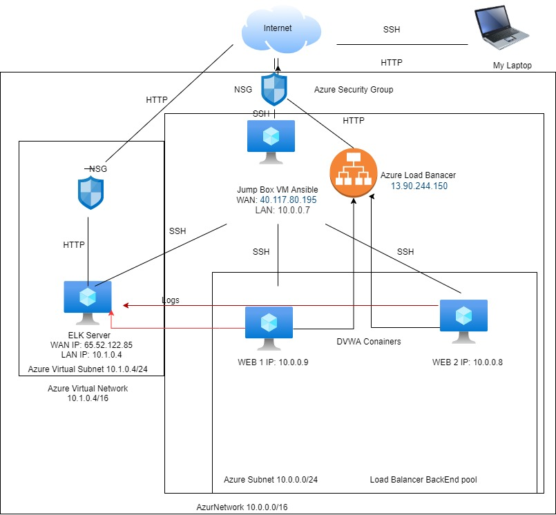
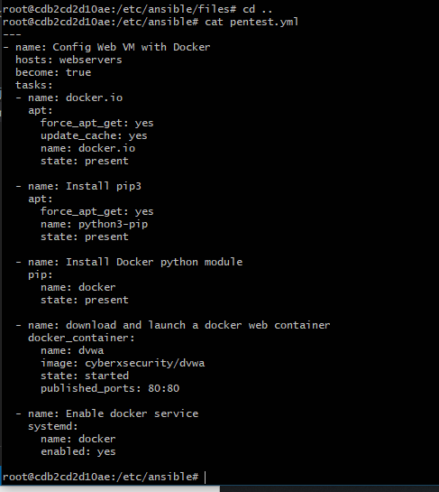
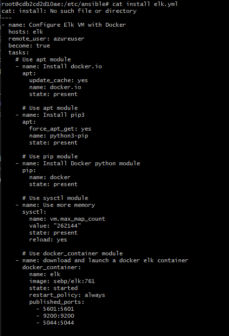

## Automated ELK Stack Deployment

The files in this repository were used to configure the network depicted below.

These files have been tested and used to generate a live ELK deployment on Azure. They can be used to either recreate the entire deployment pictured above. Alternatively, select portions of the __Playbook___ file may be used to install only certain pieces of it, such as Filebeat.

  

This document contains the following details:
- Description of the Topologu
- Access Policies
- ELK Configuration
  - Beats in Use
  - Machines Being Monitored
- How to Use the Ansible Build

### Description of the Topology

The main purpose of this network is to expose a load-balanced and monitored instance of DVWA, the D*mn Vulnerable Web Application.

Load balancing ensures that the application will be highly __Available___, in addition to restricting __Access___ to the network.
-  What aspect of security do load balancers protect? Load balancers protects Availabilty and speed.What is the advantage of a jump box? End connect securly through SSH and deloy ansible.

Integrating an ELK server allows users to easily monitor the vulnerable VMs for changes to the _performance_ and _system files modification and files access
- : What does Filebeat watch for?_system files
- : What does Metricbeat record? CPU usage RAM usage internet connection speed.

The configuration details of each machine may be found below.
_Note: Use the [Markdown Table Generator](http://www.tablesgenerator.com/markdown_tables) to add/remove values from the table_.

| Name     | Function | IP Address | Operating System |
|----------|----------|------------|------------------|
| Jump Box | Gateway  | 10.0.0.7 23.96.82.51  | Linux            |
| Elk Server|Log review|10.1.0.4 65.52.122.85  | Linux            |
| Web1     | simulating website|10.0.0.9| Linux       |
| web2     | simulating website|10.0.0.8| Linux       |

### Access Policies

The machines on the internal network are not exposed to the public Internet. 

Only the _jumpbox____ machine can accept connections from the Internet. Access to this machine is only allowed from the following IP addresses:
- _Add whitelisted IP addresses_My Public IP

Machines within the network can only be accessed by SSH _____.
- Which machine did you allow to access your ELK VM? Jump box
What was its IP address?_10.0.0.7

A summary of the access policies in place can be found in the table below.

| Name     | Publicly Accessible | Allowed IP Addresses |
|----------|---------------------|----------------------|
| Jump Box | Yes                 | My Public IP  |
|   Elk    | NO                  | red team network   10.0.0/24  |
|Web server| No                  | red team network    10.0.0.0/24 |
Web server 2 No                    red team network    10.0.0.0/24
### Elk Configuration

Ansible was used to automate configuration of the ELK machine. No configuration was performed manually, which is advantageous because...
- What is the main advantage of automating configuration with Ansible?_saves time, avoid human error

The playbook implements the following tasks:
- _TODO: In 3-5 bullets, explain the steps of the ELK installation play. E.g., install Docker; download image; etc._
- 
- ...

The following screenshot displays the result of running `docker ps` after successfully configuring the ELK instance.

### Target Machines & Beats
This ELK server is configured to monitor the following machines:
- List the IP addresses of the machines you are monitoring_
web1: 10.0.0.9
web2: 10.0.0.8

We have installed the following Beats on these machines:
- _Specify which Beats you successfully installed_
metricbeats
filebeats

These Beats allow us to collect the following information from each machine:
- _TODO: In 1-2 sentences, explain what kind of data each beat collects, and provide 1 example of what you expect to see. E.g., `Winlogbeat` collects Windows logs, which we use to track user logon events, etc._

filebeats collects information of requested files
metricbeats collects information about the cpu usage of the VMs and the traffic recieved.

### Using the Playbook
In order to use the playbook, you will need to have an Ansible control node already configured. Assuming you have such a control node provisioned: 

SSH into the control node and follow the steps below:
- Copy the _playbook____ file to _ansible____.
- Update the _playbook____ file to include...the config of the Vms and their IP
- Run the playbook, and navigate to _VM___ to check that the installation worked as expected.

_Answer the following questions to fill in the blanks:_
- _Which file is the playbook? elk.yml pentest.yml
Where do you copy it?_ansible
- _Which file do you update to make Ansible run the playbook on a specific machine? host file
How do I specify which machine to install the ELK server on versus which to install Filebeat on?_puting the IP of theVm in the Host file on the elk server or web server

- _Which URL do you navigate to in order to check that the ELK server is running?
http://65.52.122.85:5601/app/kibana#/home

_As a **Bonus**, provide the specific commands the user will need to run to download the playbook, update the files, etc._  ansible-playbook pentest.yml
sudo docker container start amazing_bhaskara